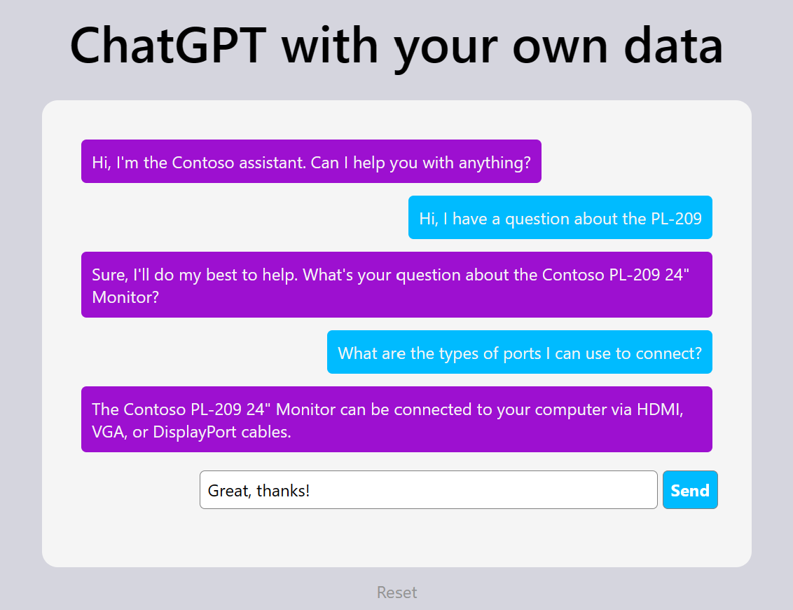

# ChatGPT with your data

__Note: For demonstration purposes only__

A simple demo for building a custom ChatGPT-based chat bot that can answer questions about organization-specific data. 

Steps to run locally:
1. Make sure the dependencies listed in [requirements.txt](app/requirements.txt) are installed.
1. In your Azure OpenAI resource, deploy `gpt-35-turbo`, `text-search-curie-doc-001`, and `text-search-curie-query-001` models and name them accordingly.
1. Add your Azure OpenAI key and endpoint to your Key Vault. Ensure that the secret names match those in [app.py](app/app.py).
1. Set the `KEUVAULT_URI` environment variable.
1. In your terminal, navigate to the `/app` directory and execute `flask run`.
1. Find the app running on `http://127.0.0.1:5000/`.